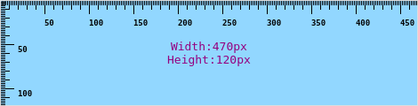

# QRuler

[![ci]](https://github.com/redtide/qruler/actions/workflows/build.yml)
[![packages]](https://repology.org/project/qruler/versions)

A simple on-screen pixel meter, based on [IRuler] (SPDX ID: GPL-2.0-or-later).



## Dependencies

Under Debian based systems:

- cmake
- qtbase5-dev
- qttools5-dev
- lxqt-build-tools

## Build

```bash
cmake -B build -DCMAKE_BUILD_TYPE=Release -DCMAKE_INSTALL_PREFIX=/usr
cmake --build build
DESTDIR="$(pwd)/package" cmake --build build --target install
```

## Licenses

- QRuler is licensed under the [GPLv3] license.
- Application icon is from [openclipart], [CC0-1.0] license.
- Alternative icons are part of [Oxygen icon set], [LGPLv3].


[ci]:              https://github.com/redtide/qruler/actions/workflows/build.yml/badge.svg
[packages]:        https://repology.org/badge/latest-versions/qruler.svg?header=packages
[CC0-1.0]:         https://creativecommons.org/publicdomain/zero/1.0/
[GPLv3]:           LICENSE
[IRuler]:          https://github.com/jjzhang166/IRuler/
[LGPLv3]:          resources/icons/COPYING
[openclipart]:     https://openclipart.org/
[Oxygen icon set]: https://github.com/KDE/oxygen-icons/
